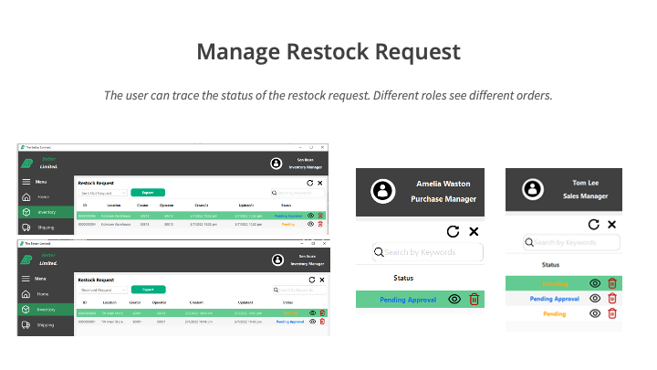
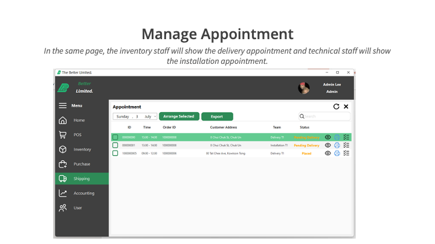
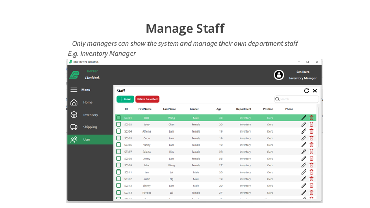

# The Better Limited ERP System


## Background

Better Limited is a small retail corporation selling electronic appliances. It consists of one office, one warehouse, and two retail stores. There are approximately 90 employees in Better Limited at the moment. As the company expands, it aims to extend its business not only the local market but also the market in the Pearl River Delta Region. The demand for having a new computerized management system has become much larger because of the expansion.

## Features

- Login

    
    
    
    
- POS

    
    
    
    
    
    
    
    
    
    
    
    

- Purchase management

    
    
    
    


    
- Inventory management

    
    
    

- Shipping management

    
    
    
    

- Accounting management

    
    

- Supplier management

    

- User management

    
    

- Other

    
    
    

    
    
    

## Tech Stack

- Frontend:
  - C# winform

- Backend:
  - C# .Net MVC
  - XAMPP MYSQL


## UI

<object data="./docs/UI.pdf" type="application/pdf" width="700px" height="700px">
    <embed src="./docs/UI.pdf">
        <p>This browser does not support PDFs. Please use the link below to get the PDF file.</p>
        <a href="./docs/UI.pdf">UI.pdf</a></p>
    </embed>
</object>

## User Guide

<object data="./docs/UserGuide.pdf" type="application/pdf">
    <embed src="./docs/UserGuide.pdf">
        <p>This browser does not support PDFs. Please use the link below to get the PDF file.</p>
        <a href="./docs/UserGuide.pdf">UserGuide.pdf</a></p>
    </embed>
</object>

## Installation

1. Download the executable from [here](https://github.com/Ryuuu825/ITP4915M-2022/releases/tag/release)

2. Extract the zip file

3. Start the Xampp MySQL server

4. Import the SQL file in the `SQL` folder
    - Please change the config of xampp to allow the import of large file
        - Change the [max_allowed_packet = 1M] to [max_allowed_packet = 1024M]

5. Double Click TheBetterLimited-Server.exe to start the server. The server are build with .Net runtime included, so you don't need to install .Net runtime

6. Double Click TheBetterLimited-System to start the client.

## Build by yourself

1. Make sure you have following software installed
    - Xampp
    - .Net 6.0 SDK
    - Entity Framework Core Tools

2. Create the database that will be same as you specify in secret.conf

3. Create three folder “./var” and “./var/log” and “./var/tmp” under build directory. You can change set this in project.csproj

4. Create a file call secret.conf under ./etc

    ```text
    # The Mail Account

    ServerURL="smtp.example.com"
    Port="587"
    Domain="@example.com"
    Username="your user name"
    DisplayedName="TheBetterLimited -- IT Team"
    Password="your password"

    # The API token
    Token="ThisRequiredALongToken"

    # MySQL connection string

    ConnectionString="Data Source={db};Initial Catalog={};User Id={user};password={pw};ConnectionTimeout=5"

    ```

5. Migration the database

    - Run the following command to migration the database

        ```bash
        dotnet ef database update --project ./TheBetterLimited-Server
        ```

    - If you want to create a new migration, run the following command

        ```bash
        dotnet ef migrations add {migration name} --project ./TheBetterLimited-Server
        ```

6. Run the following command to

    - build the server

        ```bash
        dotnet publish -c Release --self-contained true -o ./build/TheBetterLimited-Server --project ./TheBetterLimited-Server
        ```

    - run locally

        ```bash
        dotnet run --project ./TheBetterLimited-Server
        ```
