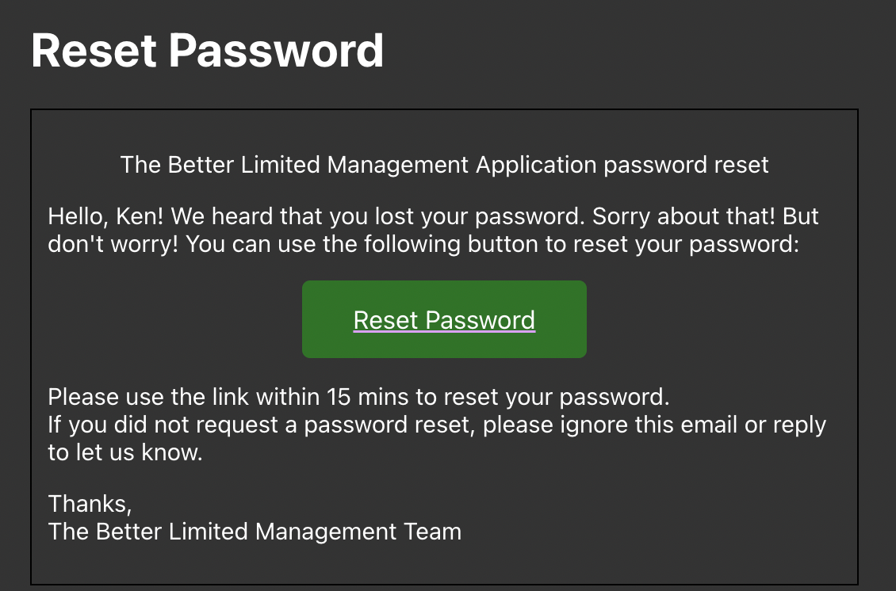
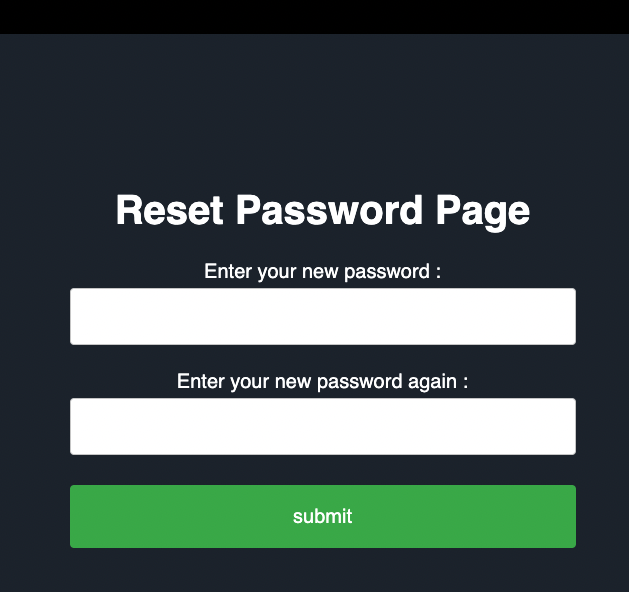

Table of content

1. [Stardard](#standard)
2. [Authentication](#authentication)
3. [Resources](#Resources)
    1. [Users](#Users)
## Stardard

- query string
  - use ';' as separator
  - query string use ':' as key value separator
  - There are two type of query string
  
        1. *key value pair* ```key:value;key:value;key:value;```
        2. *the server will auto match the attribute* ```value;value;value```

## Authentication

#### login to the system 

```
POST /api/login
```

example request body
```json
{
  "userName": "Ken",
  "password": "Ken"
}
```

* If the login is success the server will return following content (maybe change in the future)
```json
{
  "status": "Authenticated",
  "token": "{This is a bearer token}",
  "expireAt": "2022-05-15T23:17:23.024766+08:00",
  "account": {
    "id": "S0001",
    "userName": "Ken",
    "password": "$HASH|V1$10000$xqJ+jOkLGBkdq8fFUv/oDpz+1zdDSj4Bp9L6ccIRJ8z0CZnW",
    "emailAddress": "user@example.com",
    "status": "N",
    "_StaffId": null,
    "remarks": "string"
  }
}
```

* If the login is failed (username or email does not match )the server will return <strong style="color:red">HTTP  status code 401</strong> with following content.
```txt
Invalid username or password
```

*  Besides, if the user is found but the password is wrong, the server automatically increase the failed login count. And lock user account if the user's failed login count is bigger than 3. And following context will be returned.
```json
{
  "status": 401,
  "message": "The password is incorrect. The account is lock until {date time}"
}
```

#### forgot password
```
POST /api/login/requestresetpwd?lang={lang}
```

example request body. The system will found if the user with the username and email address provied. If the user is found, the system will send an email to the user's email address. 
```json
{
  "userName": "Ken",
  "emailAddress": "user@example.com"
}
```

Example response:
* HTTP 200 Ok
* HTTP 400 Bad Request : The language type is not support
```json
{
  "status": 400,
  "message": "Language not supprt: zh-en"
}
```

example email 


this is the page that the user will visit to reset the password.

exameple: `http://localhost:5233/api/login/resetpwd/page?token=2iypdyz4.duf&lang=en`


As you can see the token is in the url. The token is generated by the system. The token is valid for 15 mins. And will be expired once the user reset the password. The token is basically the filename of tmp file that stores user's bearer token. And the bearer token is insert into the head of the html page.


## Resources

### Users

#### get the template of AccountDto

```
GET /api/Users/index
```

response

```json
{
  "Id": null,
  "UserName": null,
  "Password": null,
  "EmailAddress": null,
  "Status": null,
  "_StaffId": null,
  "Remarks": null
}
```

---

#### get the user accounts

```
GET /api/Users?limit={limit}
```

example response body

```json
[
  {
    "id": "sdfsd",
    "userName": "sfsdf",
    "password": "11",
    "emailAddress": "121",
    "status": "O",
    "_StaffId": "12345",
    "remarks": "string"
  },
  {
    "id": "strin",
    "userName": "string",
    "password": "11",
    "emailAddress": "121",
    "status": "O",
    "_StaffId": null,
    "remarks": "string"
  }
]
```

- HTTP BadRequests : the limit is out of range

```JSON
{
  "status": 400,
  "message": "Limit is invalid."
}
```

- HTTP NotFound : the user is not found

```json
{
  "status": 404,
  "message": "Account with id S0002 is not exist"
}
```

example request

```
GET /api/Users?limit=123
```

---

#### get the user account by id

```
GET /api/Users/{id}
```

[see me](#get-the-user-accounts)

---

#### create a user account

```
POST /api/Users
```

example request body example:

```json
{
  "id": "S0002",
  "userName": "string",
  "password": "string",
  "emailAddress": "user@example.com",
  "status": "O",
  "remarks": "string"
}
```

few exception will raise if the request body is invalid

- BadRequest : Cannot construct instance of type 'AccountDto' from JSON object.

```json
{
  "errors": {
    "Status": [
      "The field Status must be a string or array type with a maximum length of '1'.",
      "The field Status must match the regular expression '(O|N|L)'."
    ],
    "EmailAddress": [
      "The EmailAddress field is not a valid e-mail address."
    ]
  },
  "type": "https://tools.ietf.org/html/rfc7231#section-6.5.1",
  "title": "One or more validation errors occurred.",
  "status": 400,
  "traceId": "00-a25d278698b98ef70c0b112e8b3cb1ef-3447b12c91f467b3-00"
}
```

- BadRequest : The primary key 'Id' is duplicated.

```json
{
  "status": 400,
  "message": "The staff already have a account"
}
```

- BadRequest : The foregin key 'Id' not found.

```json
{
  "status": 400,
  "message": "Staff is not exist in database."
}
```

---

#### search a user account using query string

```
GET /api/Users/sql?querystring={querystring}
```

example response body

```json
[
  {
    "id": "sdfsd",
    "userName": "sfsdf",
    "password": "11",
    "emailAddress": "test@example.com",
    "status": "O",
    "_StaffId": "12345",
    "remarks": "string"
  },
  {
    "id": "strin",
    "userName": "string",
    "password": "11",
    "emailAddress": "test@example.com",
    "status": "O",
    "_StaffId": null,
    "remarks": "string"
  }
]
```

---

#### update a user account

```
PUT /api/Users/{id}
```

example request body example:

```json
[
  {
    "attribute": "EmailAddress",
    "value": "abs@domain.com"
  },
  {
    "attribute": "Remarks",
    "value": "tgus us a remarks"
  }
]
```

example response body example:

```json
{
  "id": "S0002",
  "userName": "string",
  "password": "string",
  "emailAddress": "abs@domain.com",
  "status": "O",
  "_StaffId": null,
  "remarks": "tgus us a remarks"
}
```

- BadRequest : No Account is found

```
{
  "status": 400,
  "message": "No such user"
}
```

- BadRequest : No Attribute is found

```json
{
  "status": 400,
  "message": "Attribute IAMAwrongAttribute is invalid."
}
```

- BadRequest : The value is invalid

```json
{
  "status": 400,
  "message": "Invalid value: The EmailAddress field is not a valid e-mail address."
}
```

---

#### update a range of user accounts using query string

```
PUT /api/Users?querystring={querystring}
```

[see this](#update-a-user-account)

---

#### delete a user account

```
DELETE /api/Users/{id}
```

Http OK response: in plain text with its id

```txt
S0001
```

- BadRequest : No Account is found

```json
{
  "status": 400,
  "message": "No such user"
}
```

---

#### lock a user account

```
POST /api/Users/lock
```

Http OK response: its lock status

```txt
User Locked until 27/09/2049 23:20:07 days
```

- BadRequest : No Account is found

```json
{
  "status": 400,
  "message": "No such user"
}
```

- BadRequest : The lock day is negative

```json
{
  "errors": {
    "value": [
      "The value field is required."
    ],
    "lockDay": [
      "Error converting value -10 to type 'System.UInt32'. Path 'lockDay', line 3, position 16."
    ]
  },
  "type": "https://tools.ietf.org/html/rfc7231#section-6.5.1",
  "title": "One or more validation errors occurred.",
  "status": 400,
  "traceId": "00-66596f2cc272a973292a5a52ac1816d3-845a1ac5573e4216-00"
}
```

---

#### unlock a user account

```
POST /api/Users/unlock
```

example request body example

```
{
  "id": "strin"
}
```

Http OK response: in plain text with its id

```
strin
```

- BadRequest : No Account is found

```json
{
  "status": 400,
  "message": "No such user"
}
```

---

### message
Bearer token is needed to access this endpoint

#### get message

```json
GET /api/message
```
example response body:
```json
{
  "messageReceived": 4,
  "messages": [
    {
      "senderName": "admin",
      "sentDate": "05/17/2022",
      "content": "string"
    },
    {
      "senderName": "admin",
      "sentDate": "05/17/2022",
      "content": "string"
    },
    {
      "senderName": "admin",
      "sentDate": "05/17/2022",
      "content": "我係"
    },
    {
      "senderName": "admin",
      "sentDate": "05/17/2022",
      "content": "string"
    }
  ]
}
```

or if no message is found
```json
{
  "messageReceived": 0,
  "messages": []
}
```

----

#### send message
you can specify the message content and the receiver id. You can send message to multiple users at the same time.

```
POST /api/message
```

example request body:
```json
{
  "receiver": [
    "S0002", "strin"
  ],
  "content": "我係"
}
```

